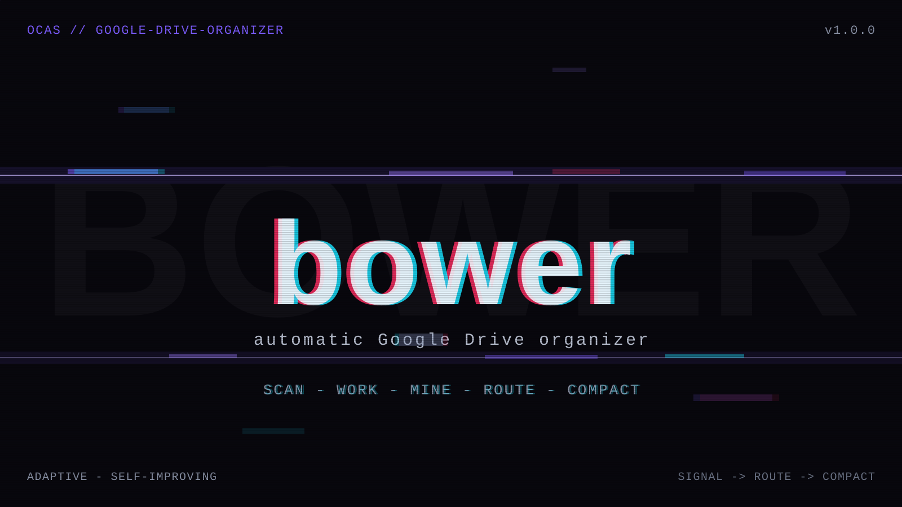

# bower

bower — Bower: automatic Google Drive organizer — scans, categorizes, and reorganizes Drive files using personalized preferences.

> One clear job, done well.

## What it does

Bower scans Google Drive structure and content, builds a personalized preference profile based on your existing organization patterns, applies domain-specific logic for categorization, and executes non-destructive moves (no deletions — only renames, moves, and description updates).

## Dependencies

- Google Drive API
- Google Places API (for location-based file context)

---

*Bower is part of the [OCAS Agent Suite](https://github.com/indigokarasu).*

---

*bower is part of the [OCAS Agent Suite](https://github.com/indigokarasu).*

---
